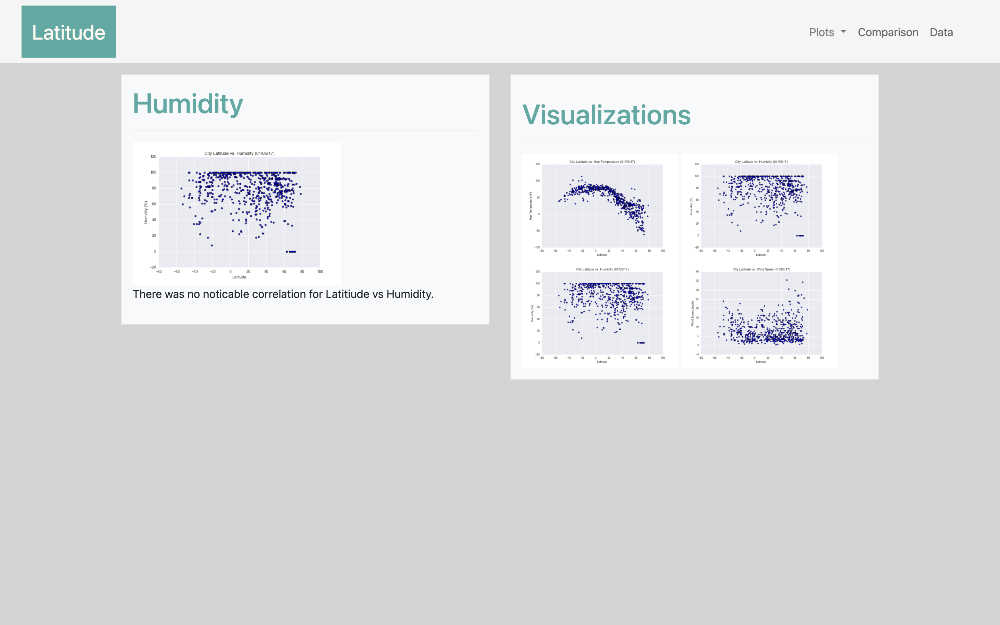

### Weather-Web-Design
#### <i> A dashboard showing off the analysis of weather patterns.</i>

----------------------

**Description:**

Created a visualization dashboard website using visualizations from previous work.

This dashboard includes individual pages for each plot and a means by which to navigate between them. These pages contain the visualizations and their corresponding explanations. There is also a landing page, a page where we can see a comparison of all of the plots, and another page where we can view the data used to build them.

<b>Datasets used:</b>

* [Cities](Resources/cites.csv)

### Tools used:
----------------------

  - HTML 
  - CSS
  - Bootstrap

###  Data Visualization:
----------------------
#### Landing page

#### Comparisons page

#### Data page

#### Visualization pages

Max Temperature:

Humidity:

Cloudiness:

Wind Speed:

